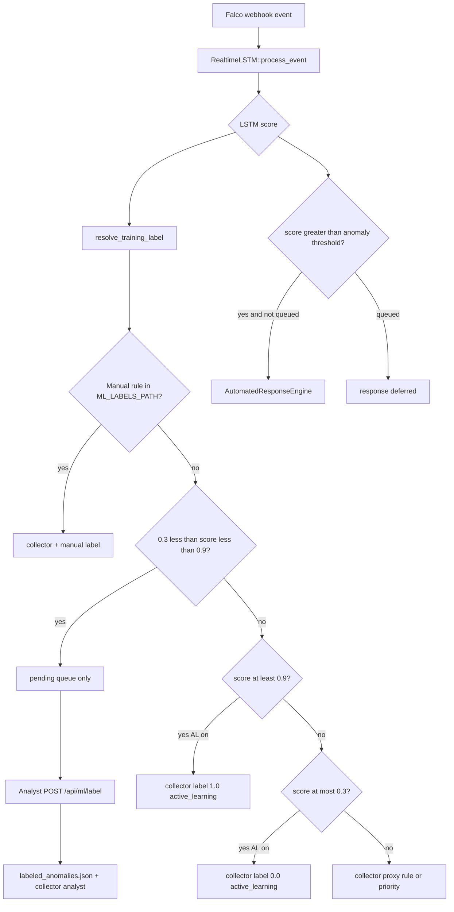

# Labeling workflow — сбор ценных размеченных данных

Этот документ описывает, **как именно** система решает, что отправить аналитику, что записать в буфер обучения и что сохранить как ground truth. Код: [`src/ml/labeling_queue.rs`](../src/ml/labeling_queue.rs), [`src/falco_integration.rs`](../src/falco_integration.rs) (`FalcoEventHandler::process`).

См. также: [ML_ARCHITECTURE.md](./ML_ARCHITECTURE.md), [PROJECT_STATUS.md](./PROJECT_STATUS.md).

---

## Главный принцип: в очередь — только «серая зона»

Модель выдаёт один скор `score ∈ [0, 1]` (вероятность аномалии от LSTM).

**В очередь ручной разметки попадают только события, у которых:**

```text
ML_AL_LOW_CONFIDENCE  <  score  <  ML_AL_HIGH_CONFIDENCE
```

По умолчанию: **0.3 < score < 0.9**.

Реализация:

```rust
// src/ml/labeling_queue.rs
pub fn is_uncertain_score(score: f64, low: f64, high: f64) -> bool {
    score > low && score < high
}
```

### Что мы намеренно НЕ делаем

| Устаревший / опасный подход | Почему плохо | Текущее поведение |
|----------------------------|--------------|-------------------|
| `if priority == "Critical" { 1.0 }` и сразу в очередь | Аналитик дублирует уже проставленную метку; модель учится на severity, а не на инцидентах | Priority — только **fallback** в `event_labeling`; в очередь **не** идёт из-за Critical |
| Отправлять в очередь все `score > ML_ANOMALY_THRESHOLD` (например > 0.7) | Сотни «очевидных» атак; лишняя работа | Порог 0.7 влияет на **автоответ**, не на очередь |
| Писать proxy-метку в collector, пока событие в pending | Модель обучается на неверной метке до решения аналитика | При постановке в очередь: `skip_collector = true` |

Функции `process_with_ml`, `add_unlabeled_event`, `combined_score` (z-score + LSTM) в текущей ветке **отсутствуют**.

---

## Поток обработки одного Falco-события



Порядок в коде (`FalcoEventHandler::process`):

1. Сначала **инференс** LSTM → `score`.
2. Затем `resolve_training_label(score, event, …)`.
3. Если не `skip_collector` → событие в `DataCollector` с выбранной меткой и источником.
4. Если `enqueue_for_analyst` → `LabelingQueue::enqueue` (без записи proxy в collector).
5. При необходимости auto-train по размеру буфера.
6. Если `score > ML_ANOMALY_THRESHOLD` и событие **не** в очереди → автоматический response.

---

## Таблица решений по диапазону score

Значения по умолчанию: `ML_AL_LOW_CONFIDENCE=0.3`, `ML_AL_HIGH_CONFIDENCE=0.9`, `ML_ANOMALY_THRESHOLD=0.7`, `ML_ACTIVE_LEARNING=true`, `ML_LABELING_QUEUE=true`.

| score | Очередь `/api/ml/pending` | Буфер обучения (collector) | Источник метки | Автоответ (если включён) |
|-------|---------------------------|----------------------------|----------------|--------------------------|
| 0.10 | нет | да, label `0.0` | `active_learning` | нет |
| 0.50 | **да** | **нет** (ждём аналитика) | — | **отложен** (событие в очереди) |
| 0.75 | **да** | **нет** | — | **отложен** |
| 0.95 | нет | да, label `1.0` | `active_learning` | да (score > 0.7) |
| 0.95 + правило в `labels.json` | нет | да, по файлу | `manual` | зависит от score |

Границы **исключающие**: при `score == 0.3` или `score == 0.9` событие **не** считается uncertain (см. unit-тест `uncertain_band_excludes_edges`).

Чтобы сузить «серую зону» до 0.3–0.7, как в обсуждении:

```bash
export ML_AL_HIGH_CONFIDENCE=0.7
```

---

## Три подхода к данным

### 1. Ручная разметка через API (ground truth)

**Назначение:** единственный источник меток, которые можно считать подтверждёнными инцидентами / ложными срабатываниями.

**Структура в очереди** (`UnlabeledAnomaly`):

| Поле | Описание |
|------|----------|
| `id` | UUID для `POST /api/ml/label` |
| `timestep` | 8-D вектор (`falco_event_to_lstm_timestep`) |
| `predicted_score` | скор LSTM в момент детекта |
| `rule`, `priority`, `output` | контекст для аналитика |
| `reason` | всегда `uncertain_score` для очереди |

**Важно:** в объекте очереди **нет** поля `label` — аналитик не видит «уже проставленную» метку Critical/1.0.

**API:**

```bash
# Список ожидающих разметки
curl -s http://localhost:3000/api/ml/pending | jq .

# Подтвердить: true = атака, false = ложная тревога
curl -s -X POST http://localhost:3000/api/ml/label \
  -H 'Content-Type: application/json' \
  -d '{"id":"<uuid-from-pending>","is_real_attack":true}'

# Все сохранённые analyst-метки
curl -s http://localhost:3000/api/ml/labeled | jq .

# Обучить LSTM только на analyst-файле
curl -s -X POST http://localhost:3000/api/ml/train_labeled
```

**После `POST /api/ml/label`:**

1. Запись удаляется из pending.
2. Добавляется в `data/labeled_anomalies.json` (`ML_LABELED_ANOMALIES_PATH`).
3. Событие попадает в collector с `LabelSource::Analyst`.

**Переменные:**

| Variable | Default | Meaning |
|----------|---------|---------|
| `ML_LABELING_QUEUE` | `true` | Включить очередь uncertain |
| `ML_LABELING_QUEUE_MAX` | `500` | Лимит pending (старые вытесняются) |
| `ML_LABELED_ANOMALIES_PATH` | `data/labeled_anomalies.json` | Персистентный ground truth |
| `ML_AUTO_RESPONSE_ON_ANOMALY` | `true` | Response при score > threshold, **кроме** событий в очереди |

---

### 2. Синтетические сценарии (CI / cold start)

**Example:** `cargo run --example training_scenarios`

- Пишет `data/training_data.json` с 8-D `timestep` и явными `label`.
- Не заменяет production-трафик; идеально для bootstrap и CI.

```bash
ML_BOOTSTRAP_TRAIN=true cargo run   # обучение при старте, если нет модели
# или
curl -X POST http://localhost:3000/api/ml/train_real
```

**CI (рекомендация):** на каждый PR с изменениями в `src/ml/` — scenarios → train_real → проверка, что F1/accuracy не падают относительно baseline.

---

### 3. Active learning (минимум ручного труда)

**Включено:** `ML_ACTIVE_LEARNING=true` (по умолчанию).

| Зона score | Действие |
|------------|----------|
| ≤ `ML_AL_LOW_CONFIDENCE` | Автоматическая метка `0.0` в collector (`active_learning`) |
| ≥ `ML_AL_HIGH_CONFIDENCE` | Автоматическая метка `1.0` в collector |
| между low и high | Только очередь аналитику; collector **не** получает proxy |

Приоритет над active learning:

1. Запись в `ML_LABELS_PATH` (`manual`)
2. Иначе — active learning / proxy по таблице выше

**Переменные active learning:**

| Variable | Default |
|----------|---------|
| `ML_ACTIVE_LEARNING` | `true` |
| `ML_AL_LOW_CONFIDENCE` | `0.3` |
| `ML_AL_HIGH_CONFIDENCE` | `0.9` |

---

## Каскад источников меток (для метрик)

В `GET /api/ml/labels` и `/ml/status` доступна разбивка `label_sources`:

| Источник | Значение | Доверие |
|----------|----------|---------|
| `analyst` | `POST /api/ml/label` | Ground truth |
| `manual` | `ML_LABELS_PATH` / `POST /api/ml/labels` | Задано человеком по правилу |
| `active_learning` | score ≤ low или ≥ high | Авто, высокая уверенность модели |
| `rule` | эвристика по имени правила / тегам | Proxy |
| `priority` | Critical / Alert / … | Proxy (не инцидент!) |

---

## Различие порогов (частая путаница)

| Порог | Env | Назначение |
|-------|-----|------------|
| **Uncertain band** | `ML_AL_LOW_CONFIDENCE`, `ML_AL_HIGH_CONFIDENCE` | Кто идёт к аналитику; что **не** попадает в collector до разметки |
| **Alert threshold** | `ML_ANOMALY_THRESHOLD` (0.7) | Когда вызывать `AutomatedResponseEngine` (блокировка, изоляция и т.д.) |

Пример: `score = 0.85` → в очереди аналитику (0.3 < 0.85 < 0.9), автоответ **не** срабатывает, пока событие в pending и `ML_AUTO_RESPONSE_ON_ANOMALY=true`.

Пример: `score = 0.95` → не в очереди, collector получает `1.0`, автоответ **срабатывает** (0.95 > 0.7).

---

## Рекомендуемый production-цикл

1. Запуск с `ML_ACTIVE_LEARNING=true`, `ML_LABELING_QUEUE=true`.
2. Ежедневно: `GET /api/ml/pending` → разметка → `POST /api/ml/label`.
3. Ночью: `POST /api/ml/train_labeled` или объединение `labeled_anomalies.json` с bootstrap-данными.
4. Периодически: обновлять `ML_LABELS_PATH` для стабильно известных правил.
5. CI: `training_scenarios` + регрессия метрик.

---

## Формат `labeled_anomalies.json`

Массив объектов после подтверждения аналитиком:

```json
[
  {
    "id": "550e8400-e29b-41d4-a716-446655440000",
    "timestamp": "2026-05-15T12:00:00Z",
    "labeled_at": "2026-05-15T12:05:00Z",
    "timestep": [4.0, 1.0, 1.0, 1.0, 0.5, 1.0, 1.0, 0.0],
    "label": 1.0,
    "predicted_score": 0.55,
    "rule": "Reverse Shell",
    "priority": "Critical",
    "source": "analyst"
  }
]
```

---

## Отладка

```bash
# Статус ML на webhook-порту
curl -s http://localhost:8080/ml/status | jq '.pending_analyst_labels, .label_sources, .active_learning'

# Сводка на API-порту
curl -s http://localhost:3000/api/ml/stats | jq .
```

Логи при постановке в очередь: `Queued anomaly <uuid> for analyst (score=..., rule=...)`.

Unit-тесты логики uncertain: `cargo test labeling_queue`.
